# RNN

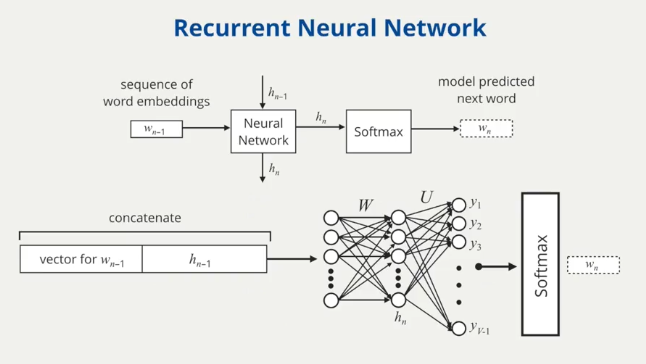

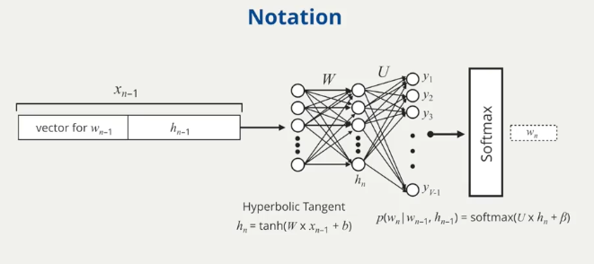

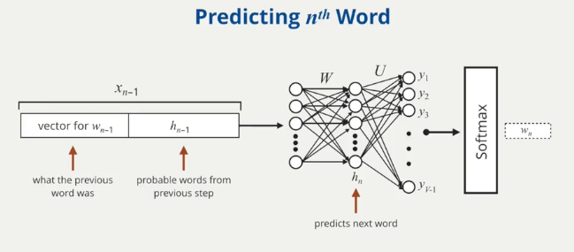

# LSTM

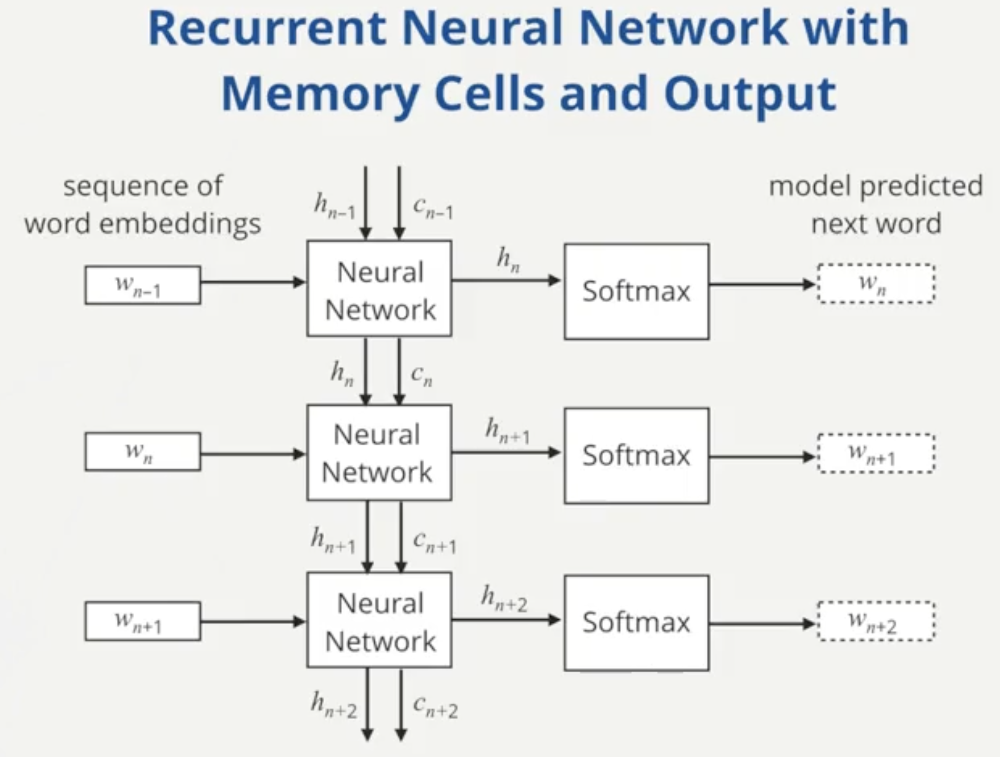

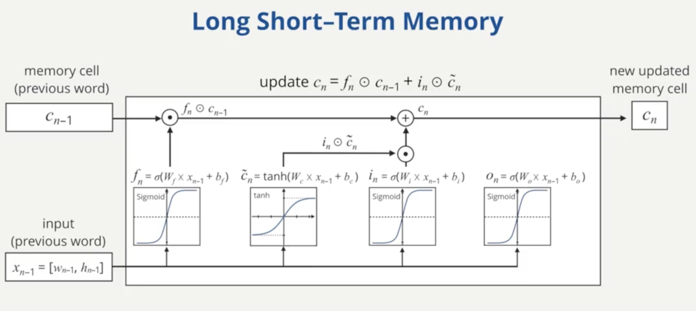

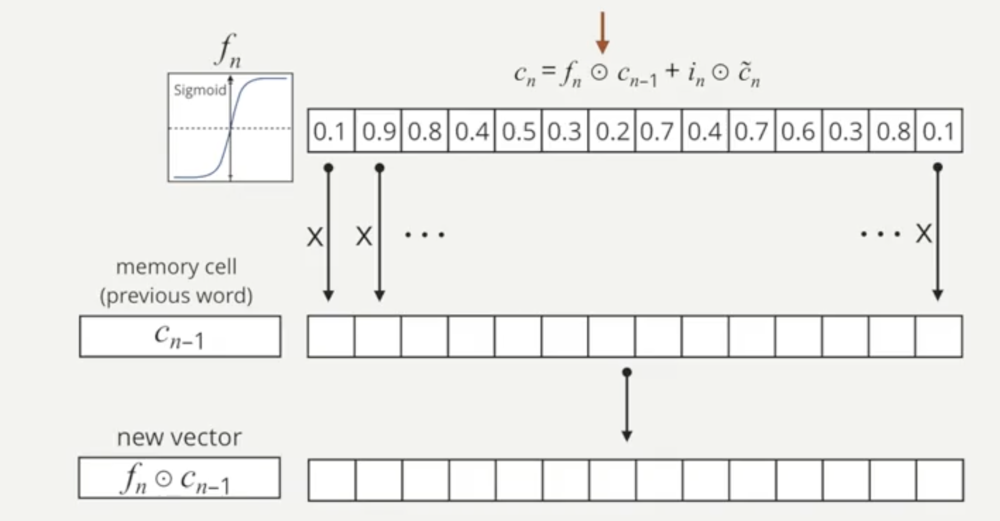

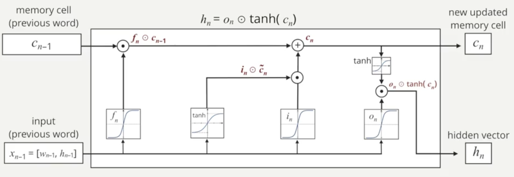

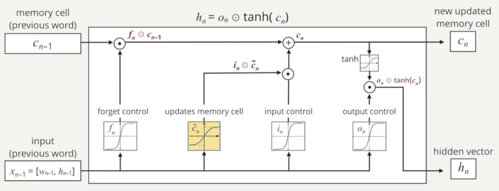

- The model can foget previous data through f_n
- The model can input new data through i_n
- The O_n controls the degree to which the memory cell goes to the output of the hidden vectors

# Application of RNNs

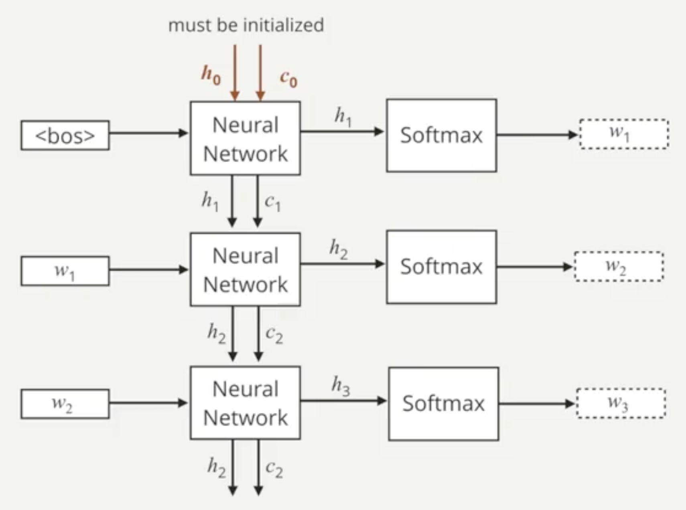

# 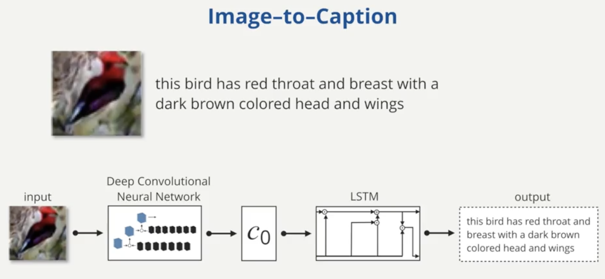

# Sentiment Analysis in NLP

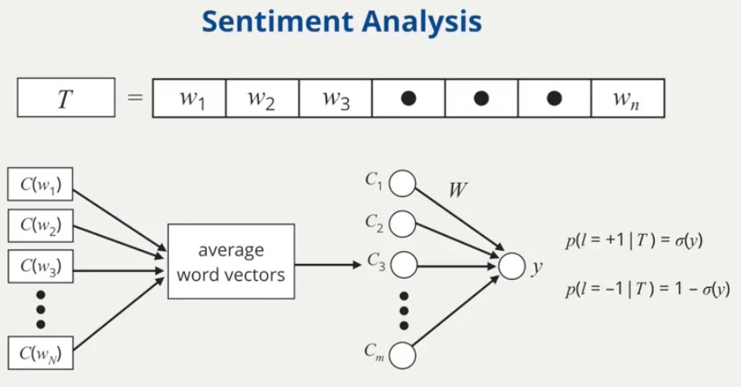

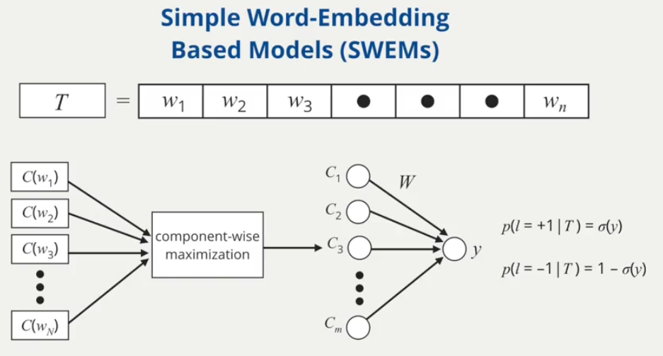

More blog post of LSTMs: 

- https://colah.github.io/posts/2015-08-Understanding-LSTMs/
- http://karpathy.github.io/2015/05/21/rnn-effectiveness/